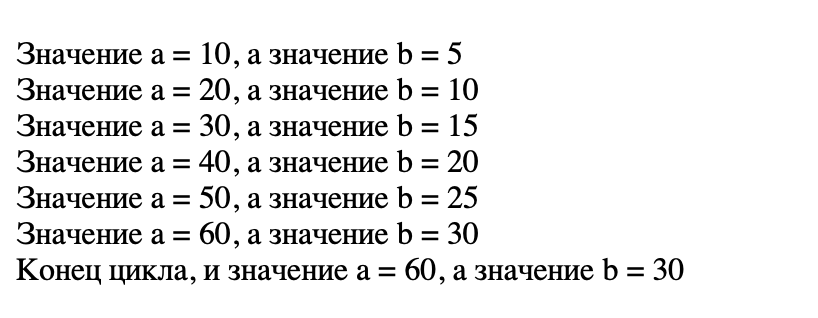
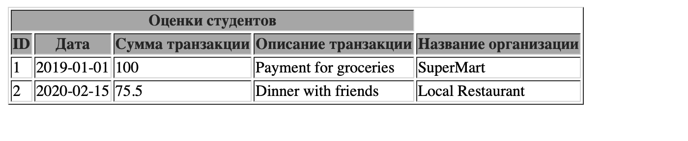
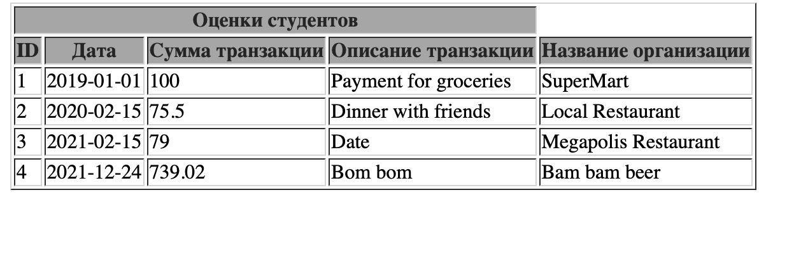
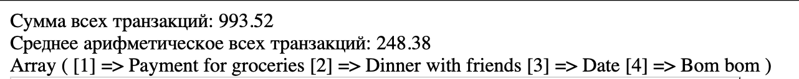

# Лабораторная работа №3

## Поменяйте скрипт так чтобы, выводились, дополнительно, и все  промежуточные значения для a и b:
```php
$a = 0; $b = 0;
for ($i = 0; $i <= 5; $i++) {
 $a += 10;
 $b += 5; 
 echo "<br />Значение a = " . $a . ", а значение b = " . $b;
}
echo "<br />Конец цикла, и значение a = " . $a . ", а значение b = " . $b;
```

## Напишите код задания №1 с помощью цикла while

```php
$a = 0; $b = 0;$i = 0;
while ($i <= 5) {
 $a += 10;
 $b += 5; 
 $i++;
 echo "<br />Значение a = " . $a . ", а значение b = " . $b;
}
echo "<br />Конец цикла, и значение a = " . $a . ", а значение b = " . $b;
```

## Напишите программу, которая будет генерировать массив случайных чисел от 1 до 100 с помощью цикла for или while.
```php
$arr = array();

for ($i = 0; $i < 10; $i++) {
    $arr[] = rand(1, 100);
}
echo "Сгенерированный массив: ";
print_r($arr);
```
## 2. Выведите на экран данные о транзакциях

```php
 <tr>
        <td><?php echo $transaction["transaction_id"]; ?></td>
        <td><?php echo $transaction["transaction_date"]; ?></td>
        <td><?php echo $transaction["transaction_amount"]; ?></td>
        <td><?php echo $transaction["transaction_description"]; ?></td>
        <td><?php echo $transaction["merchant_name"]; ?></td>
 </tr>
```

## 3. Добавьте данные еще для 2-3 транзакций ассоциативный в массив

```php
 [
 "transaction_id" => 3,
 "transaction_date" => "2021-02-15",
 "transaction_amount" => 79.00,
 "transaction_description" => "Date",
 "merchant_name" => "Megapolis Restaurant",
 ],
 [
"transaction_id" => 4,
"transaction_date" => "2021-12-24",
"transaction_amount" => 739.02,
"transaction_description" => "Bom bom",
"merchant_name" => "Bam bam beer",
 ],
 ```

 

 ## 4. Определение 3 пользовательские функции и выведите их значение на экран
 4.1. Функция calculateTotalAmount() рассчитывает общую сумму всех транзакций
 ```php
 function calculateTotalAmount($transactions) {
    $sum = 0;
    foreach ($transactions as $transaction) {
        $sum += $transaction["transaction_amount"];
    }
    echo "Сумма всех транзакций: " . $sum;
}

calculateTotalAmount($transactions);
```
4.2. Функция calculateAverage() рассчитывает среднее арифметическое 
всех транзакций
```php
function calculateAverage($transactions) {
    $sum = 0;
    foreach ($transactions as $transaction) {
        $sum += $transaction["transaction_amount"];
    }
    echo "Среднее арифметическое всех транзакций: " . $sum / count($transactions);
}

calculateAverage($transactions);
```
4.3. Функция mapTransactionDescriptions() возвращает новый массив, 
содержащий только описания транзакций
```php
function mapTransactionDescriptions($transactions) {
    $transaction_description_arr = [];
    $i = 1;
    foreach ($transactions as $transaction) {
        $transaction_description_arr[$i] = $transaction["transaction_description"];
        $i++;
    }
    return print_r($transaction_description_arr);
}

mapTransactionDescriptions($transactions);
```


## 1.5. Задание №5 Работа с файловой системой

```php
<!DOCTYPE html>
<html lang="en">
<head>
    <meta charset="UTF-8">
    <meta name="viewport" content="width=device-width, initial-scale=1.0">
    <title>Галерея изображений</title>
    <style>
        body {
            font-family: Arial, sans-serif;
            margin: 0;
            padding: 0;
            background-color: #f4f4f4;
        }

        header {
            background-color: #333;
            color: white;
            padding: 1em;
            text-align: center;
        }

        nav {
            background-color: #555;
            padding: 1em;
            text-align: center;
        }

        nav a {
            color: white;
            text-decoration: none;
            margin: 0 1em;
        }

        #content {
            display: flex;
            flex-wrap: wrap;
            justify-content: space-around;
            padding: 1em;
        }

        #content img {
            width: 33%;
            height: 600px;
            padding-bottom: 5px;
        }

        footer {
            background-color: #333;
            color: white;
            padding: 1em;
            text-align: center;
        }
    </style>
</head>
<body>

<header>
    <h1>Галерея изображений</h1>
</header>

<nav>
    <a href="#">Главная</a>
    <a href="#">О нас</a>
    <a href="#">Контакты</a>
</nav>

<div id="content">
    <?php
    // Задаем путь к папке с изображениями
$dir = 'image/';
// Сканируем содержимое директории
// scandir — Получает список файлов и каталогов, расположенных по 
// указанному пути.
// Возвращает array, содержащий имена файлов и каталогов, расположенных по 
// пути, переданному в параметре
$files = scandir($dir);
// Если нет ошибок при сканировании
if ($files === false) {
 return; }
    for ($i = 0; $i < count($files); $i++) {
        // Пропускаем текущий каталог и родительский
        if (($files[$i] != ".") && ($files[$i] != "..") && ($files[$i] != ".DS_Store")) {
            // Получаем путь к изображению
            $path = $dir . $files[$i];
            // Выводим изображение на экран
            echo '';

        }
    }
    ?>
</div>

<footer>
    <p>2024 Pictures. Все права защищены.</p>
</footer>

</body>
</html>
```
